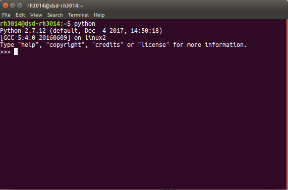
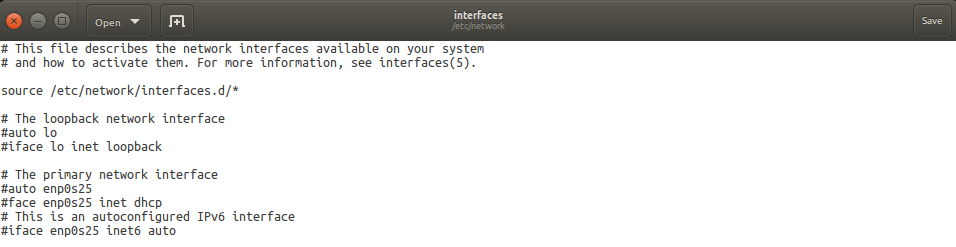
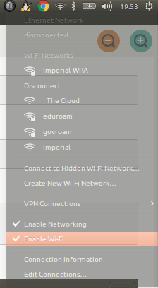

# Perception & Interface Design

**VERY IMPORTANT (the following information may save your ass (well, tons of hours of installation))**: if you are using ubuntu, be careful with anaconda because conda Interference might prevent the required packages from being installed into the system python (if your don't define your `PATH` to search for packages clearly in the environment, and each time you try to install a package, the computer will automatically find the installed package which might not in the required directory e.g. Anaconda). Disable the conda python and force the program to use the system default python instead is a secured choice. Then always use `pip install` (or with a `sudo` in the front in some cases) to install all the packages required to run the project.

### Python Configuration

Due that the main system platform ROS could only run with Python2 at the time the project has been built, it's essential to set Python2 as the default python. In Ubuntu, execute the following commands to set default python:

```bash
sudo gedit ~/.bashrc
```
and add the following line to the end of the file:

```
alias python=python2
```
comment out the anaconda PATH:

```python
# added by Anaconda2 4.4.0 installer
# export PATH="/home/rh3014/anaconda2/bin:$PATH"

# added by Anaconda3 installer
# export PATH="/home/rh3014/anaconda3/bin:$PATH"
# Virtual Environment Wrapper
# source /usr/local/bin/virtualenvwrapper.sh
```

> By setting the route in `.bashrc`, force the program to look for the directory of default python.

> If you intend to switch back to python3, simple change the line added to ```alias python=python3```.

Then, open terminal, type `python` and execute, something analogous to the following lines will show up:



### Network Configuration

#### (Optional) Ubuntu Ethernet Network Manipulations

In order to run the project smoothly, all computers involved in the system have to be under the same network. For this specific project, all computers were connected via ethernet. The following session is just for the purpose to make sure Ubuntu connect to ethernet properly.

Firstly, `ctrl` + `alt` + `t` to open the terminal and register as root:

```bash
$ sudo bash
```
> `ctrl` + `d` to exit root mode.

Then navigate to the network directory for further manipulations:

```bash
$ cd /etc/network
```
After that, edit the `interfaces` file:

```bash
$ less interfaces
$ gedit interfaces
```
Within the `interfaces` file, you should be seeing contents like the following:



Then simply comment out everything below the line of: `source /etc/network/interfaces.d/*`

After all the above has been done, reintall and update the network drivers and managers in case it has not been properly installed:

```bash
$ apt-get install network-manager-pptp network-manager-pptp-gnome
```
After that, plug in the wired connection and disable the WiFi connection left only wired connection avaible by click 



Finally, restart the wired connection by:

```bash
$ systemctl restart network-manager.service
```
and the wired connection should be working properly for future project developments.

#### Ckecking Network Configuration

In order to make sure the computer running "perception" process is in the same network environment with the ROS master, check the network configuration of the "perception" computer by: 

```bash
$ ifconfig -a
$ export ROS_IP=`hostname -I`
```
> In this case two IP addresses need to be particularly noted: 
> - the IP host for baxter in Robotics Intelligence Lab is `192.168.0.99` and the `ROS_MASTER_URI` port is `http://192.168.0.99:11311/`;
> - the IP host for DE VITO computer is `192.168.0.103`.

For subscribing to the baxter ROS master and exporting data and information into the ROS master, execute the following commands:

```bash
export ROS_MASTER_URI=http://192.168.0.99:11311/
export ROS_IP=192.168.0.103
```
> **Note**: every time openning a new terminal, needs to export the above two lines or the environment settings won't be applied to the new terminal.

> In order to check whether it is online, execute: 
> 
> ```
> $ roslaunch openni2_launch openni2.launch
> $ rostopic list
> ```
> and all the topics that have been subscribed will be listed.

> If you encounter the error of:
> 
> ```
> Couldn't find an AF_INET address for [robin-pc-8](YOUR HOST COMPUTER)
> ```
> This indicates that the wired cable is not connected properly, unplug it and plug back and re-run the whole command.

After all, execute:

```
$ rviz
```
to proceed further manipulations with ROS.

</br>


### Graphic Card Configuration (for Vive & Kinect Camera)

For the purpose of setting up a proper environment for the Vive Headset and Kinext Camera Sensor, certain steps of driver package configurations have to been processed. 

#### Cuda Installation

For this particular project, the Vive headset and Kinect are compatible and running in maximum efficiency with combination of nvidia-384 driver and `cuda-8.0`, thus need to make sure installing cuda as first priority by downloading the package from https://developer.nvidia.com/cuda-80-ga2-download-archive

`$ ls -tr` to set the list as time order to find the latest download in the directory.

Execute the following command to make the file executable:

```bash
$ chmod +x cuda_8.0.61_375.26_linux.run
$ sudo ./cuda_8.0.61_375.26_linux.run
```
in different terminal

```bash
$ export PATH=$PATH:/usr/local/cuda-8.0/bin
$ export LD_LIBRARY_PATH=/usr/local/cuda-8.0/lib64
```

#### Kinect Configuration

In order to run Kinect Camera, two essential packages have to be installed: `libfreenect2` and `OpenNI2`.

##### `libfreenect2` Installation

In prior for `libfreenect2` to work, another package of `libturbojpeg` has to be installed as prerequisite:

```bash
$ apt-get install libturbojpeg
```
Then, go to the website of `libfreenect2` and start installation by clone the repository into your local directory:

Then start building procedures:

```bash
$ mkdir build && cd build
$ cmake .. -DCMAKE_INSTALL_PREFIX=$HOME/freenect2 -DCUDA_TOOLKIT_ROOT_DIR=/usr/local/cuda-8.0
$ make clean
$ make
$ make install
```
> **Note**: crucial stuff is to let the computer look for `/usr/local/cuda-8.0`

> If you encounter the installation error of: 
> 
> ```
> /home/rh3014/libfreenect2/src/cuda_kde_depth_packet_processor.cu:39:25: fatal error: helper_math.h: No such file or directory
> ```
> Try edit the `CMakeLists.txt` file (might not be working) and add the following two lines into it, force the program to overwrite:
> 
> ```
> CXXFLAGS="-fPIC"
> CFLAGS="-fPIC"
>```

If the build execution doesn't work properly, try `cmake` it again and force it to look for the directory of Cuda:

```bash
$ cmake .. -DCMAKE_INSTALL_PREFIX=$HOME/freenect2 -DCUDA_TOOLKIT_ROOT_DIR=/usr/local/cuda-8.0
```
> **Note**: remember to remove the CMakeCache.txt file everytime you re-cmake it
>
>```bash
>$ rm CMakeCache.txt
>```

After that, execute the `make` command:

```bash
$ make -j
$ make -j install
```
If the build succeeded, something analagous to the following should be seen as response in the terminal:

```
-- Install configuration: "RelWithDebInfo"
-- Installing: /home/rh3014/freenect2/lib/libfreenect2.so.0.2.0
-- Installing: /home/rh3014/freenect2/lib/libfreenect2.so.0.2
-- Installing: /home/rh3014/freenect2/lib/libfreenect2.so
-- Installing: /home/rh3014/freenect2/include/libfreenect2
-- Installing: /home/rh3014/freenect2/include/libfreenect2/logger.h
-- Installing: /home/rh3014/freenect2/include/libfreenect2/packet_pipeline.h
-- Installing: /home/rh3014/freenect2/include/libfreenect2/frame_listener.hpp
-- Installing: /home/rh3014/freenect2/include/libfreenect2/frame_listener_impl.h
-- Installing: /home/rh3014/freenect2/include/libfreenect2/registration.h
-- Installing: /home/rh3014/freenect2/include/libfreenect2/libfreenect2.hpp
-- Up-to-date: /home/rh3014/freenect2/include/libfreenect2
-- Installing: /home/rh3014/freenect2/include/libfreenect2/config.h
-- Installing: /home/rh3014/freenect2/include/libfreenect2/export.h
-- Installing: /home/rh3014/freenect2/lib/cmake/freenect2/freenect2Config.cmake
-- Installing: /home/rh3014/freenect2/lib/cmake/freenect2/freenect2ConfigVersion.cmake
-- Installing: /home/rh3014/freenect2/lib/pkgconfig/freenect2.pc
-- Installing: /home/rh3014/freenect2/lib/OpenNI2/Drivers/libfreenect2-openni2.so.0
-- Installing: /home/rh3014/freenect2/lib/OpenNI2/Drivers/libfreenect2-openni2.so
```
> **Note**: One benefit installing packages into the directory of `/usr/local` is that other programs may look to `/usr/local` by default, thus the package might be potentially used for other purposes as well.

Eventually, install `OpenNI2` and use `roslaunch` command to launch the program: 

```bash
$ sudo apt-get install ros-kinetic-openni2-launch
$ roslaunch openni2_launch openni2.launch
```

Navigate to the directory where you intend to 


#### Vive Configuration

Firstly, check the Nvdia version on the perception host computer by:

```bash
$ nvidia-smi
```

```bash
$ apt-get update
$ apt-get install dnsmasq
```
> Dnsmasq is a lightweight, easy to configure, DNS forwarder and DHCP server. It is designed to provide DNS and optionally, DHCP, to a small network. It can serve the names of local machines which are not in the global DNS. The DHCP server integrates with the DNS server and allows machines with DHCP-allocated addresses to appear in the DNS with names configured either in each host or in a central configuration file. Dnsmasq supports static and dynamic DHCP leases and BOOTP/TFTP for network booting of diskless machines


#### (Optional) might not work on all computers

Graphic card installation for the Vive

```bash
sudo apt-add-repository ppa:graphics-drivers/ppa
```

#### WebCam Configuration

Other than using the Kinect Sensor, an plausible althernative would be using two Web Cameras to stream through into two screens in the Vive. In order to proceed via this path, the `usb_cam` packages need to be compiled in to the catkin workspace.

Firstly, download `usb_cam` folder from box into `src` directory, then execute:

```bash
$ catkin_make
```
for compiling the ros packages in the workspace. 

After a while, something similar to these following lines should be seen as response:

```
Scanning dependencies of target usb_cam
[ 25%] Building CXX object usb_cam/CMakeFiles/usb_cam.dir/src/usb_cam.cpp.o
[ 50%] Linking CXX shared library /home/rh3014/catkin_ws/devel/lib/libusb_cam.so
[ 50%] Built target usb_cam
Scanning dependencies of target usb_cam_node
[ 75%] Building CXX object usb_cam/CMakeFiles/usb_cam_node.dir/nodes/usb_cam_node.cpp.o
[100%] Linking CXX executable /home/rh3014/catkin_ws/devel/lib/usb_cam/usb_cam_node
[100%] Built target usb_cam_node
```
which means it has been successfully compiled.

> **Note**: since the path of the camera has not been added in `.bashrc`, it is needed to `source catkin_ws/devel/setup.bash` in order to make the camera been seen by other programs/

After that, run:

```bash
roslaunch usb_cam camera.launch
```
to check the stream reponse from the camera.

> **Note** since two cameras has been added to the system, check the `camera.launch` file, the following two lines are defining the camera topic:
> 
> ```
> <remap from="image" to="/camera1/usb_cam1/image_raw"/>
> ...
> <remap from="image" to="/camera2/usb_cam2/image_raw"/>
> ```
> in this case, `camera1` and `camera2`.
> 
> If no camera plugged in, the built in camera will be recognised as one of the cameras. In addition, if these two lines of configuration hasn't been added, the default camera will be recognised as `camera0`.


```bash
chmod +x ROS_imgProcessing2.py
```

using echo to check whether there is an output from the host master (baxter `export ROS_MASTER_URI=http://192.168.0.110:11311/`)

```bash
rostopic echo /camera/depth/image_raw
```

using echo to check whether the output from the remote computer is working
in this case:

```bash
rostopic echo image_topic_2
```

**Note**: Common Problems:

```
Unable to register with master node [http://localhost:11311/]: master may not be running yet. Will keep trying.
```
to solve this, simply need to run 

```bash
roscore
```

```
cd /opt/ros/kinetic
source setup.bash
```
and source the new kinetic to the workspace

#### Set up udev rules for device access: 

**Tip**: Search for `90-kinect2.rules` by

```bash
find / -name 90-kinect2.rules
```
which is `/home/rh3014/libfreenect2/platform/linux/udev/90-kinect2.rules` for this project.

and:

```bash
find / -name rules.d
```
which is `/etc/udev/rules.d` for this project.

```bash
sudo cp /home/rh3014/libfreenect2/platform/linux/udev/90-kinect2.rules /etc/udev/rules.d/
```
then replug the Kinect.

Run `Protonect` for testing whether kinect is running properly or not

```bash
find / -name Protonect
```
--> `/home/rh3014/libfreenect2/build/bin/Protonect`

if no device connected/:

```
Version: 0.2.0
Environment variables: LOGFILE=<protonect.log>
Usage: /home/rh3014/libfreenect2/build/bin/Protonect [-gpu=<id>] [gl | cl | clkde | cuda | cudakde | cpu] [<device serial>]
        [-noviewer] [-norgb | -nodepth] [-help] [-version]
        [-frames <number of frames to process>]
To pause and unpause: pkill -USR1 Protonect
[Info] [Freenect2Impl] enumerating devices...
[Info] [Freenect2Impl] 9 usb devices connected
[Info] [Freenect2Impl] found 0 devices
no device connected!
```

### Depth Sensor Algorithm

https://www.pyimagesearch.com/2015/01/19/find-distance-camera-objectmarker-using-python-opencv/

https://docs.opencv.org/3.1.0/dd/d53/tutorial_py_depthmap.html