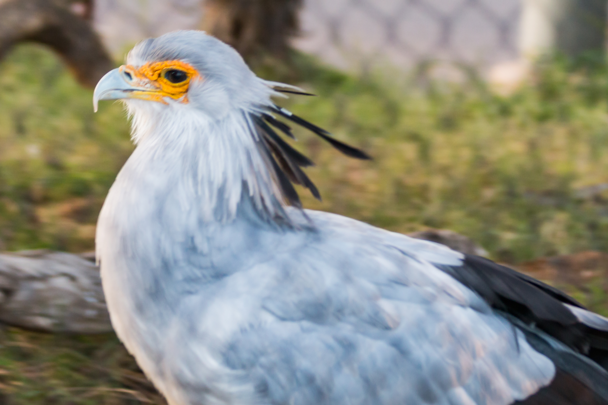
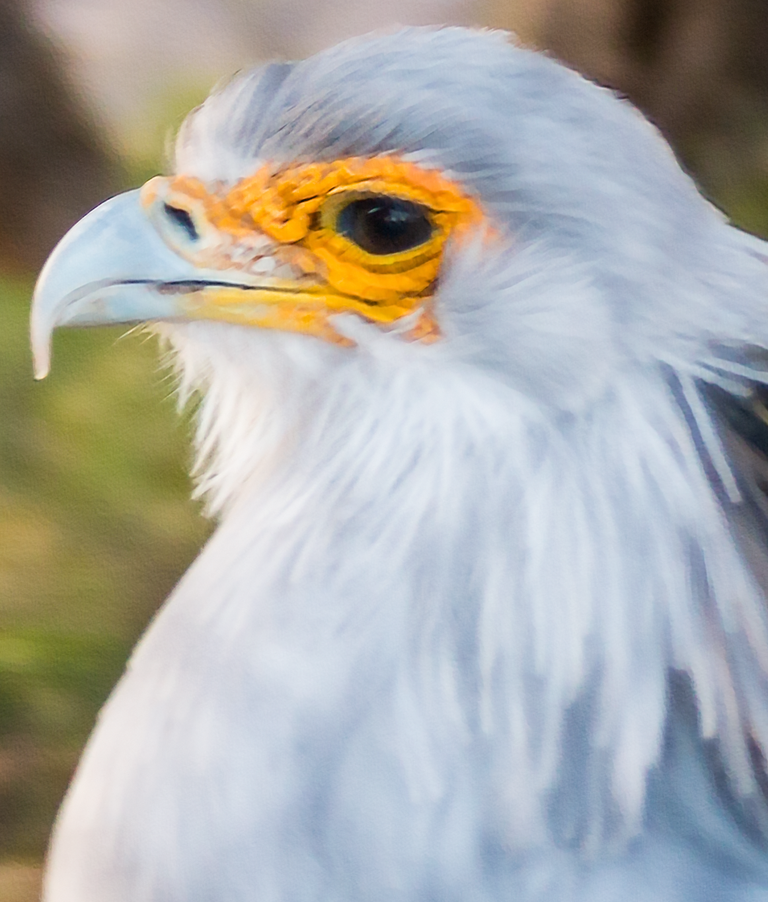
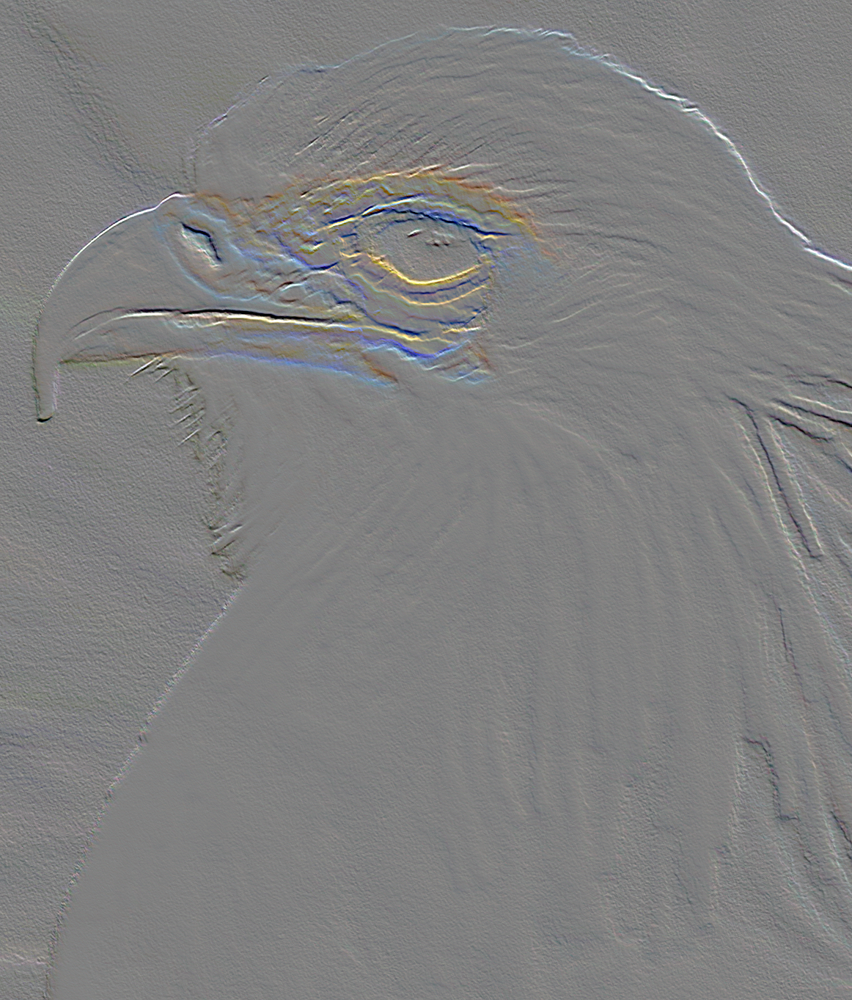

# Blur

<!--- Motion Blur Session --->

## Motion Blur - Uniform & Linear

### Principle:

### Generation:
      
#### Algorithms:

### Compensation:

#### Prototype: Sharpening with Emboss

**the original image**

<table>
	<tr>
		<th></th>
	</tr>
</table>

##### 1) Smart Sharpening:

No pre-set settings, carry out experiments, due that their angles, pixels are very different to each other

If we crop the image to the place most significantly shows the effect of motion blur (in this case: around eyes)

<table>
  	<tr>
    	<th>Original</th>
    	<th>After Smart Sharpening</th>
  	</tr>
  	<tr>
    	<td></td>
    	<td></td>
  	</tr>
</table>

##### 2) Further compensating with Emboss

- Emboss with Angle opposite to the angle of removing sharpening, if the same angle as above, will compound the halos
    
	- Height: 1px
	- Amount: 500%
	- Blending Option: Overlay (or try other modes in the overlay category)

<table>
  	<tr>
    	<th>After Smart Sharpening</th>
    	<th>After Emboss</th>
  	</tr>
  	<tr>
    	<td></td>
    	<td></td>
  	</tr>
</table>

Emboss Algorithm: <https://www.packtpub.com/mapt/book/application_development/9781785283932/2/ch02lvl1sec23/embossing>

**Blend Mode: Overlay:**

<table>
  	<tr>
    	<th>Emboss Normal Blend Mode</th>
    	<th>Emboss Overlay Blend Mode</th>
  	</tr>
  	<tr>
    	<td></td>
    	<td></td>
  	</tr>
</table>

<!--- Defocus Blur Session --->

## Defocus Blur - Isotropic Gaussian Kernel

### Principle:

### Generation:

#### Algorithms:

<!--- Defocus Blur Session --->

## Patch Blur - Extra Defocus Blur on Randomly Picked Patches

### Principle:

### Generation:

#### Algorithms:

### Compensation, Prevention & Preprocessing: Sharpening

> GENERAL REFERENCE: https://www.cambridgeincolour.com/tutorials/image-sharpening.htm

#### Prototype:

**"Sharpen More" filter**: old raw command working on low resolution images

**"Unsharp Mask(important)" filter**: old school conventional technique: take the image, blur it then invert it and apply it as a mask of the original image

> - Unsharp Mask is essentially brightening the bright side of and edge, and darkening the dark edge
> - Thickness of the edge is determined by the **Radius**,
> - Threshold calms down the sharpening of the noise which is arbitrary variations in neighbouring pixels. Taking the threshold value up will eliminate the sharpening of he noises

- Principle:

	- https://en.wikipedia.org/wiki/Unsharp_masking
	- https://www.cambridgeincolour.com/tutorials/unsharp-mask.htm
	- https://docs.gimp.org/en/plug-in-unsharp-mask.html

- Implementation:

	- http://www.cnblogs.com/Imageshop/archive/2013/05/19/3086388.html
	- https://blog.csdn.net/matrix_space/article/details/78345483 (WITHOUT OpenCV)

- "**Blending sharpening effect**":

	> - For exaggerated Unsharp Mask effects, we get some sort like purple surrounded by yellow, which is due that we are sharpening all three channels
	> - change the blend mode from normal to luminosity and those edges will disappear, because we are no longer sharpening the colour but just sharpening the details
	> - ALWAYS using **`amount`** of max 500, blending mode of luminosity and change the opacity of the mask to adjust

- "**Smart Sharpen**":

	> - by comparing with the above sharpening effect, less halos along the edge and less black areas
	> - Use Gaussian Blur to produce the unsharpening effect

- "**Lens Blur and Reduce Noise**":
  
	- Smart Sharpen, Amount 500%; Radius 4.5px; 50% Reduce Noise

	> Gaussian Blur is designed when you down sample an image or working with a scanned photograph, but when working with a digital photograph, Lens Blur is going to produce better, crisper effects.

"**Preventing Shadow/highlight clipping**"(by far best outcome):

- Amount: 500%
- Radius: 6.0px
- Reduce Noise: 50%

	**Shadows**:

	- Fade Amount: 10%
	- Tonal Width: 50%
	- Radius: 50px

	**Highlights**:
    
	- Fade Amount: 10%
    - Tonal Width: 50%
    - Radius: 50px
    
	"**Sharpening with the High Pass Filter**":
  
	> it naturally avoids clipping, which is useful for sharpening portrait shots
  	
	> Both High Pass and Unsharp Mask reply on Gaussian Blur to do the sharpening
  	
	> give you a more pronounced, colourful effect
  
	- Implementation:
    	- https://blog.csdn.net/matrix_space/article/details/72303076 (high-pass)

	- Prototype:
	- Algorithms:

### Frost Glass Blurring Effect:

- <https://blog.csdn.net/matrix_space/article/details/40271843>