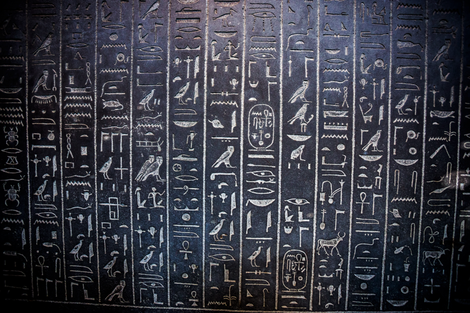
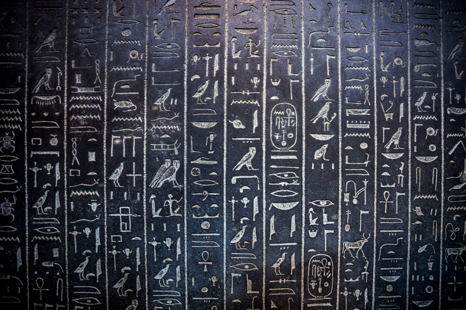

# Data Augmentation

Video noise reduction in Photoshop CC 2017: <https://www.youtube.com/watch?v=zm0IwSXoXwE>

parent web: <https://plus.google.com/+Hdesigntutorials>

## How to de-pixelate images in Photoshop

> Bicubic Interpolation - Computerphile: <https://www.youtube.com/watch?v=poY_nGzEEWM>

1. --> Image Size (Alt + Ctrl + I) --> Resolution: change the resolution to 300 pixels per inch or higher if you want, then make sure **Bicubic Automatic** option is selected
2. --> Filter --> Noise --> Reduce Noise --> play around with the settings:
    
	- Strength: 10
    - Preserve Details: 0
    - Reduce Colour Noise: 86%
    - Sharpen Details: 52%
    - tick Remove **JPEG Artifact**

<table>
  	<tr>
    	<th>Image with very Low Resolution</th>
    	<th>Image after De-pixelation</th>
  	</tr>
  	<tr>
    	<td></td>
    	<td></td>
  	</tr>
</table>

 

## Affine Transformation

#### 1. Lens Correction

1. rename and convert to smart object 
2. check:
    - Geometric Distortion
    - Chromatic Aberration
    - Vignette
        > Vignette is darkening around the corners of the image essentially caused by lens element
        > to get rid of it, that's brighten up the colour

#### 2. Distortion, Aberration and Vignette
    
1. choose `Custom` setting tag of `Lens Correction`
2. go to upper-left corner of the window, start with the `Remove Distortion Tool`:
    - dragging outward: add barrel distortion
    - dragging inward: add pincushioning distortion
3. play around with the settings in `Chromatic Aberration` and `Vignette`

#### 3. Adjusting Angle and Perspective  

1. navigate to the `Transform` tag, play around with the `Angle`
2. choose `Move Grid Tool`, change in the bottom, the grid `Color` to make the grid contrastively visible and `Size` to make it align better with the image features.  
3. go back to the `Transform` tag, play around with the `Horizontal Perspective` and `Vertical Perspective`.
    
#### 4.1 Using the Perspective Warp Command

1. set 4 `Guidelines`
2. go to `Edit`, navigate to `Perspective Warp`
    
	- establish a base setting for our boundaries that the vertices should align to the four points you want to use as reference points
	- click `Enter` entering the edit mode in step 2 to drag and adjust the image

<table>
  	<tr>
    	<th>Original Image</th>
    	<th>Image after Perspective Wrap</th>
  	</tr>
  	<tr>
    	<td></td>
    	<td></td>
  	</tr>
</table>
       
#### 4.2 Fine-Tuning the Perspective Adjustment

1. gradually improve the image by playing around the 4 vertices
2. after the four vertices of the perspective warping box aligned to the 4 boundary vertices, check if there is still geometric distortions by checking whether there are slightly curved lines. Go back to step 1 and adjust the `Geometric Distortion` value for further compensation.
    
> Beware that the last step has no preview effect influenced by the later action of perspective warp

<table>
  	<tr>
    	<th>Image after Perspective Wrap</th>
    	<th>Image after Lens Correction (solve fish-eye)</th>
  	</tr>
  	<tr>
    	<td></td>
    	<td></td>
  	</tr>
</table>

#### 5. Evening out Colour and Lighting

> This section has nothing to do with the `Lens Correction` filter but everything to do with quality image editing.

1. make sure the image layer has been selected and go to the bottom of the image click the first icon and select `Color Overlay`. 
2. darken the image by navigate to `Layer`, choose `Brightness/Contrast...` 
    - select the blend mode to `Multiply`
    - set the `Opacity` to `50%`
3. choose the layer mask, choose `Brush` and draw on the image's dark spots and lighten them.

<table>
  	<tr>
    	<th>Image after Lens Correction</th>
    	<th>Image after Lens Colour/ Brightness/ Contrast Tuning</th>
  	</tr>
  	<tr>
    	<td></td>
    	<td></td>
  	</tr>
</table>

---
 

### Frosted glass effect: water on the surface of the glass: 

- https://blog.csdn.net/matrix_space/article/details/78345426

## Luminance, Brightness & Contrast
	
> colour is a function of luminance

#### Auto Contrast:

1. takes the darkest pixel and make it black
2. takes the brightest pixel and make it white
3. stretches out all the other luminance levels in between

**Implementation:**

- https://blog.csdn.net/matrix_space/article/details/22951103

	- OpenCV图像增强算法实现（直方图均衡化、拉普拉斯、Log、Gamma） https://blog.csdn.net/dcrmg/article/details/53677739

	- https://blog.csdn.net/matrix_space/article/details/37913937 --> down the page bottom, find the effect of Soft Lighten & Strong Lighten

- Contrast: https://blog.csdn.net/matrix_space/article/details/72286491

- Fish Lens: https://blog.csdn.net/matrix_space/article/details/72301893

IMPORTANT: quickly get all code from the following website before the trial expires on May 11th 2018 and unsubscribe 
<https://www.packtpub.com/mapt/book/application_development/9781785283932>

Other websites: 
<https://github.com/makelove/OpenCV-Python-Tutorial>
<https://github.com/makelove/OpenCVBook>
<https://github.com/makelove/Python_Master_Courses>

<https://weibo.com/u/2368645233?refer_flag=1001030103_&is_all=1#_rnd1524814005782>

## Chromatic Aberration: 色差

### Principle

How color(wavelength affect the chromatic aberration): https://photo.stackexchange.com/questions/77810/what-determines-whether-chromatic-aberration-will-be-purple-green-or-red-cyan

### Generation

#### Prototype

#### Algorithms
  
### Compensation, Prevention & Preprocessing:

#### Prototype

Idea: blend mode: --> Luminosity

#### Algorithms

 

## add shading

